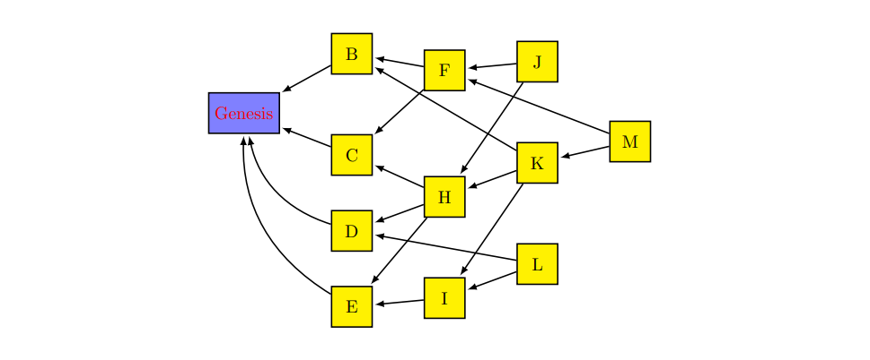

# c-blockchain-register
C language implementation of a simple transactions register which is encoded in the form of a blockchain. (BlockDAG)

## Table of Contents

1. [Getting Started](#start-description)
2. [Building](#build-description)
3. [Testing](#test-description)

<a name="start-description"></a>
## Getting Started

The blockchain register is implemented using a DAG shown in the below image:



Every blockchain register has to have a **Genesis** vertex.

The **input** blockchain register has to be in the **blockdag.in** file as follows:

```
    15
    Genesis V1 V2 V3 V4 V5 V6 V7 V8 V9 V10 V11 V12 V13 V14
    Genesis :
    V14 : Genesis
    V13 : V14 Genesis
    V8 : V13 V14 Genesis
    V12 : V8
    V11 : V12
    V7 : V8
    V10 : V7
    V6 : V7 V10
    V9 : V10
    V5 : V6 V9
    V4 : V8
    V3 : V4 V11
    V2 : V3
    V1 : V2 V3
```

**Check** [TESTS](build/tests/) folder to see more examples of correct blockchain register.

After you will build the source files the executable **blockdag** will appear and it has two main tasks:

* To check if the register is a valid DAG
* To check all the graphs sets of one selected vertex:
    * past vertices - set of vertices that are referenced directly or indirectly by the selected node
    * future vertices - represents the set with the blocks that have direct or indirect reference with selected node
    * anticone vertices - set of block vertices that do not have a reference at all with selected node
    * tips vertices - set of block vertices that have no future vertices.

### Using blocdag

To check for the first main task you should run:

```BASH
    ./blockdag -c1
```

To check sets for the second main task, you should run:

```BASH
    ./blockdag -c2 VALID_NODE_NAME
```

### Results

The results will be printed in the **blockdag.out** file in the same folder as the executable file.

<a name="build-description"></a>
## Building

In order to build the project make sure that you are on a LINUX machine or **WSL**, the enter the build folder and to run the **Makefile**:

```BASH
    cd build
    make

    # to clear all junk files and keep obj files
    make clean
```

<a name="test-description"></a>
## Testing

In order to run the tests and to see what tests are passed you should run:

```BASH
    ./blockdag_run.sh
```

I suggest if you want to understand what output can be generated from the executable file, you should check in the [TESTS](build/tests/) folder all files with **_ref** flag in their name.

### Have fun coding